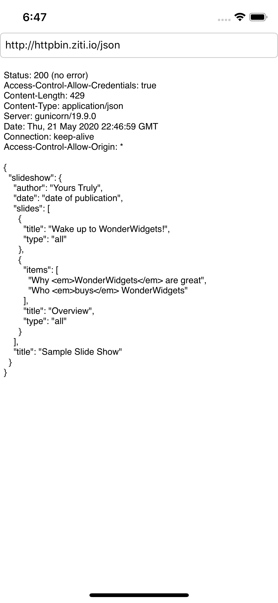

## ZitiUrlProtocol, iOS example using Objective-C

This is a simple app that demonstrates using the __Ziti SDK for Swift__ to intercept URL requests using `ZitiUrlProtocol`.

## Running the app
You will need access to an operational Ziti network.  You could:
* Build your own [from scratch](https://github.com/netfoundry/ziti-cmd/blob/master/doc/003-local-deploy.md)
* Follow one of these one these [quickstart guides](https://netfoundry.github.io/ziti-doc/ziti/quickstarts/networks-overview.html)to deploy _Ziti Edge Developer Edition_ to your AWS or Azure account 
* Subscribe to a [free trial](https://nfconsole.io/login) of NetFoundry's managed service

You will need to configure a service to intercept, such as
```
name = http-bin
hostname = httpbin.ziti.io
port = 80

endpoint host = httpbin.org
endpoint port = 80
endpoint protocol = tcp
```

And you will need an identity to associate with this application/user/device.  The identity needs to be configure to access the service (e.g., the `http-bin` service shown above). Obtain a one-time JWT token from your Ziti system and download the file to your device or simulator (e.g., via e-mail, iCloud, Dropbox, etc).

Once the app starts, it will detect that no Ziti identity information is avalable, and prompt for enrollment.  Use the DocumentPicker to select your one-time JWT enrollment file.

Once enrolloment is complete you should be able to access your services over Ziti.



The code for enrolling using the JWT and configuring `ZitiUrlProtocol` can be found in [`ViewController.m`](ViewController.m)
